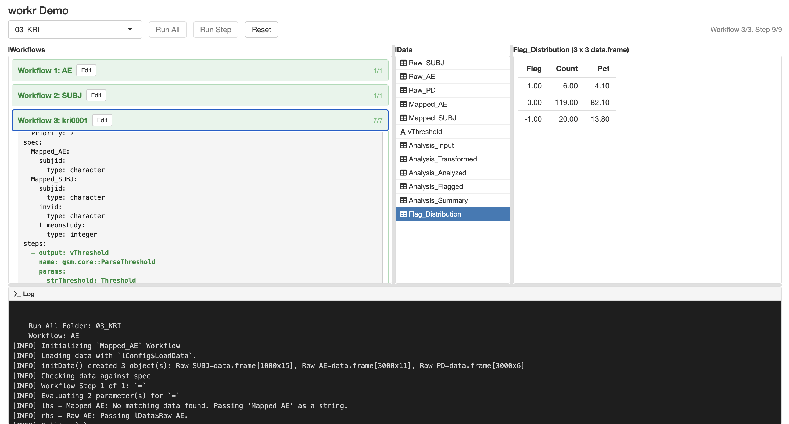

# workr

<!-- badges: start -->

<div class="pkgdown-release">

[](https://github.com/Gilead-Public/workr/actions/workflows/R-CMD-check.yaml)
[](https://github.com/Gilead-Public/workr/actions/workflows/test-coverage.yaml)
[](https://github.com/Gilead-Public/workr/actions/workflows/pkgdown-all.yaml)

</div>

<div class="pkgdown-devel">

[](https://github.com/Gilead-Public/workr/actions/workflows/R-CMD-check.yaml)
[](https://github.com/Gilead-Public/workr/actions/workflows/test-coverage.yaml)
[](https://github.com/Gilead-Public/workr/actions/workflows/pkgdown-all.yaml)

</div>

<!-- badges: end -->

A **very** simple R data pipeline framework. {workr} provides a minimal mental model for describing and executing step-by-step workflows. These simple workflows can be combined into configurable data pipelines that can automate large tasks.

## What is {workr}?

{workr} was built to solve a specific problem: **reusable, customizable data pipelines for complex clinical trial monitoring**.

The core functions in {workr} were originally developed as part of the [{gsm} framework](https://gilead-public.github.io/gsm.core/index.html) for risk-based quality monitoring (RBQM). The {gsm} team developed a [stable, reusable model for generating metrics](https://gilead-public.github.io/gsm.core/articles/DataAnalysis.html) to monitor clinical trials.

Our challenge was figuring out how to run those metrics across a large portfolio.

Take 30 studies with monthly snapshots, each needing 15 metrics computed in 5 steps, and you get 27,000 computations per year. Each study also has slightly different requirements, so maintaining individual scripts quickly becomes a massive pain.

{workr}'s solution: Define workflows once, track customizations in YAML files, and compose them into larger pipelines.

The original `gsm::RunWorkflow` functions were developed in a few hours and were seen as a stopgap until we picked a "real" pipeline.

The approach has proven to be surprisingly stable and flexible. So much so that we've created {workr} and started using it outside of our {gsm} pipelines.

## {workr} workflows

{workr} workflows are `list` objects that are typically defined in `yaml` files. Each workflow has the following components:

- **Steps** are functions that accept data and parameters, producing output that gets added to the shared data list
- **Meta** is workflow-level configuration accessible to all steps
- **Spec** optional data specification defining expected input data for the workflow.

The package provides three core functions for running workflows:

- `workr::RunStep()` - execute a single workflow step
- `workr::RunWorkflow()` - execute a workflow specification (YAML)
- `workr::RunWorkflows()` - run multiple workflows in sequence

### Sample Workflow

Define a workflow in YAML:

```yaml
# hello_cars.yaml
meta:
  ID: hello_cars
  col: speed
steps:
  - name: dplyr::pull 
    output: speed
    params:
      df: df
      col: col
  - name: mean
    output: result
    params:
      lData: speed
```

Run it from R:

```r
wf <- yaml::read_yaml("hello_cars.yaml")
lData <- list(df = cars)

result <- workr::RunWorkflow(
  lWorkflow = wf,
  lData = lData
)

# result = 15.4 (mean of cars$speed)
```

Each step in a workflow:

1. Calls a function (specified by `step$name`)
2. Passes parameters from `params` (resolving references to `lData`, `meta`, or literal values)
3. Saves the result to `lData` using the `output` name
4. Makes it available for the next step

That's it! By chaining steps (and even whole workflows) together, you can build complex pipelines from simple, reusable components.

## Configured Data Loading

`RunWorkflow()` and `RunWorkflows()` support configurable `LoadData` hooks. You can supply either a function or the name of a registered provider through `lConfig$LoadData`.

{workr} includes a built-in `"gsm.datasim"` provider for generating workflow inputs from the optional [{gsm.datasim}](https://github.com/Gilead-Public/gsm.datasim) package.

The workflow should reference the objects generated by {gsm.datasim}. For example, this YAML summarizes enrolled subjects by simulated site from `Raw_SUBJ`:

```yaml
# simulated_subjects.yaml
meta:
  Type: Example
  ID: simulated_subjects
steps:
  - output: enrolled_subjects_by_site
    name: workr::RunQuery
    params:
      df: Raw_SUBJ
      strQuery: >
        SELECT
          invid AS site_id,
          COUNT(*) AS enrolled_subjects,
          AVG(timeonstudy) AS mean_time_on_study
        FROM df
        WHERE enrollyn = 'Y'
        GROUP BY invid
        ORDER BY enrolled_subjects DESC
```

Then configure `RunWorkflow()` to load the simulated study data before the first step runs:

```r
wf <- yaml::read_yaml("simulated_subjects.yaml")

site_summary <- workr::RunWorkflow(
  lWorkflow = wf,
  lConfig = list(
    LoadData = "gsm.datasim",
    gsm.datasim = list(
      profile = "standard",
      study_type = "standard",
      participants = 250,
      sites = 25,
      snapshot_count = 1
    )
  )
)
```

The provider reads its options from `lConfig$gsm.datasim`. Common fields include `profile`, `study_type`, `participants`, `sites`, `snapshot_count`, `months_duration`, and `snapshot`. Generated `Raw_*` objects, such as `Raw_SUBJ` and `Raw_AE`, are also exposed as `df*` aliases, such as `dfSUBJ` and `dfAE`, for compatibility with existing workflows.

For more detail on configurable load and save hooks, including the built-in `"gsm.datasim"` provider, see the `Load and Save Hooks` vignette.

## Combining Workflows

{workr} workflows are designed to be chained together. The output of one workflow becomes the input for the next. {workr} provides several tools to support this functionality. 

### `workr::RunWorkflows` calls multiple workflows

While `workr::RunWorkflow` runs all the `steps` in a single workflow, `workr::RunWorkflows` (with an *s*) runs multiple workflows one after the other. Just pass a list of workflows. A few details:
- `workr::RunWorkflows()` still takes a single `lData` object as input, each workflow makes its updates, and then the updated `lData` object is passed along to the next workflow.
- `workr::MakeWorkflowList()` is an easy way to read a whole folder of YAML workflows into the format expected for `workr::RunWorkflows()`.
- `workr::MakeWorkflowList()` reorders workflows based on `meta$priority`, so if you need things to run in a certain order, make sure to set that parameter. If nothing is provided, `priority` is set to 0.

### `workr::RunProject` calls multiple sets of workflows

Use `workr::RunProject()` when a project is split into phases. Each immediate subdirectory is one phase, and each phase is run with `workr::RunWorkflows()`. Without config files, each phase's outputs are carried forward to the next phase as a flat named list.

```r
# Project directory structure:
# project/
#   01_mapping/
#     ae.yaml
#     lb.yaml
#   02_analysis/
#     kri.yaml

results <- workr::RunProject(
  strPath = "project",
  lData = list(raw_data = my_data)
)
# Runs 01_mapping workflows first, then 02_analysis
# Outputs from 01_mapping are available as inputs to 02_analysis
```

Key options:

- `strPhases` — run a subset of phases, or control their order
- `bReturnResult` / `bKeepInputData` — passed through to `RunWorkflows()`
- `bContinueOnError` — record workflow failures and keep running; the default
  keeps the existing fail-fast behavior from `RunWorkflows()`
- `bRecursive` — passed through to `MakeWorkflowList()`

Phases are sorted alphabetically by default (use numeric prefixes like `01_`, `02_` to control order).

`lConfig` can also control load/save hooks at different levels. Top-level `LoadData` and `SaveData` are passed to `RunWorkflows()` for each phase, so they run for each workflow in that phase. `lConfig$phases[["phase_name"]]` applies hooks to one phase, and `lConfig$project$LoadData` or `lConfig$project$SaveData` runs once before or after the full project.

For snapshot branches, the manifest step usually creates `manifest.csv`, `rproject.toml`, and a `workflows/` directory. Pass that `workflows/` directory to `RunProject()`.

Phase folders can include `_config.yaml` when the default carry-forward behavior is too broad. Use `input` to choose what the phase receives, and `output` to shape what later phases see.

```yaml
# workflows/3_reporting/_config.yaml
input:
  from_phases: [1_mappings]
  from_results:
    lAnalyzed: 2_metrics
  include_workflows:
    from_phase: 2_metrics
  extra:
    dSnapshotDate: "2026-06-09"
output:
  wrap_as: lReports
  transform: null
```

In this example, reporting receives mapping data, metrics results as `lAnalyzed`, the metrics workflow definitions, and a snapshot date. The reporting output is stored as `lReports`.


### `workr::Manifest` — Reproducible Package Environments

One nice thing about {workr} workflows is that they can be combined across packages. To support this, {workr} includes tooling for creating reproducible **manifests** — versioned snapshots of packages and their workflows at a point in time.

`pkgManifest()` resolves a list of GitHub packages to specific versions and generates:

- `manifest.csv` — pinned package versions with SHAs
- `rproject.toml` — [rv](https://github.com/A2-ai/rv)-compatible dependency file
- `workflows/` — merged workflow YAML files pulled from each package's `inst/workflow/`

Package manifests are stored on orphan branches (prefixed `ss-*` for "snapshot-source") and updated nightly via GitHub Actions. These branches serve as the source of truth for reproducible package environments.

📦 [Demo snapshot (`ss-demo`)](https://github.com/Gilead-Public/workr/tree/ss-demo) — gsm.core, gsm.mapping, gsm.kri, gsm.reporting

## Visualizing Workflows

YAML workflows can be a little hard to follow, especially when you're running a few (or more than a few) in a row, so we've created some tools to help visualize and track workflows.

### {workr} Shiny app



`workr::DemoApp_init()` launches a simple Shiny app application that lets you explore and run workflows in real time. A hosted version is available at [jwildfire.shinyapps.io/workr-demoapp](https://jwildfire.shinyapps.io/workr-demoapp/).

> **Note:** The hosted app includes only the basic workflow examples (`01_RunWorkflow` and `02_RunWorkflows`) to stay within shinyapps.io memory limits. Run `workr::DemoApp_init()` locally to explore all examples, including the KRI and data transformation workflows.


### open.gismo


[open.gismo](https://github.com/Gilead-BioStats/open.gismo) is an end-to-end platform for running {workr} projects on GitHub. 

## Automation via GitHub Actions

We provide several GitHub Actions to automate snapshot creation and site deployment.

| Workflow | Trigger | Purpose |
|---|---|---|
| `manifest.yaml` | Reusable / manual | Resolve packages and generate manifest artifacts on an orphan `ss-*` branch |
| `nightly-manifest.yaml` | Cron (2am UTC) / manual | Runs `manifest.yaml` for configured manifest branches |
| `pkgdown-with-examples.yaml` | Push to main/dev / PR / manual | Build pkgdown site with examples and slides |
| `pkgdown-cleanup.yaml` | PR close | Remove PR preview deployments from gh-pages |
| `R-CMD-check.yaml` | Push to main / PR | Standard R CMD check |
| `R-CMD-check-dev.yaml` | Push to dev / PR | R CMD check against dev dependencies |
| `qcthat.yaml` | PR / release / issue-close / manual | Generate issue-test coverage + UAT reports and fail on uncovered completed issues |
| `r-releaser-caller.yaml` | Manual | Release automation via r-releaser |
