## Agenda

::: {.tocbox}
1. What is {workr}? 
2. Why {workr}?
3. {workr} ❤️ {pharmaverse}
4. {workr} Apps
:::

# What is {workr}? 

A **very** simple R data pipeline 

## {workr} workflows are YAML files <above>easily parsed to an R `list` </above>

```yaml
# hello_cars.yaml
meta:
  ID: hello_cars
  col: speed
steps:
  - name: dplyr::pull 
    output: speed
    params:
      df: df
      col: col
  - name: mean
    output: result
    params:
      lData: speed
```
## `meta` captures metadata

```{.yaml code-line-numbers="1-4"}
# hello_cars.yaml
meta:
  ID: hello_cars
  col: speed
steps:
  - name: dplyr::pull 
    output: speed
    params:
      df: df
      col: col
  - name: mean
    output: result
    params:
      lData: speed
```
## `steps` are function calls

```{.yaml code-line-numbers="5-14"}
# hello_cars.yaml
meta:
  ID: hello_cars
  col: speed
steps:
  - name: dplyr::pull 
    output: speed
    params:
      df: df
      col: col
  - name: mean
    output: result
    params:
      lData: speed
```

## `meta` can be used in `steps` via `params`

```{.yaml code-line-numbers="4,8,10"}
# hello_cars.yaml
meta:
  ID: hello_cars
  col: speed
steps:
  - name: dplyr::pull 
    output: speed
    params:
      df: df
      col: col
  - name: mean
    output: result
    params:
      lData: speed
```

## `workr::RunWorkflow()` 

### Inputs 
- workflow (YAML file parsed to a `list`)
- initial data (`lData`)
  - available to all `steps` and can be updated by each step

### Output
- Returns result of last step by default 
- If `bReturnResult = FALSE` returns full workflow object with all intermediate outputs

## <above>`workr::demoApp()`</above> Example 1: Hello Cars

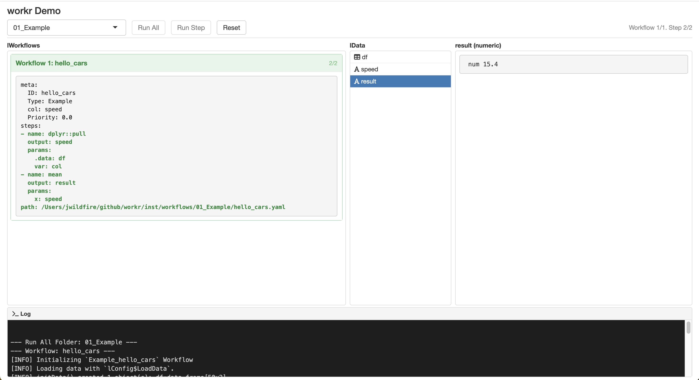

::: {.notes}
- Live demo of app. 
- Version 1a - change `col` in `meta` to `dist` and show how it updates the result without changing the steps.
- Version 1b - load `iris` dataset and show how it works with a different dataset.
:::

## `workr::RunWorkflows()`

- Convenience function to run multiple workflows in sequence
- Output of each workflow added to `lData` for the next workflow

## <above>`workr::demoApp()`</above> Example 2: Chaining Workflows

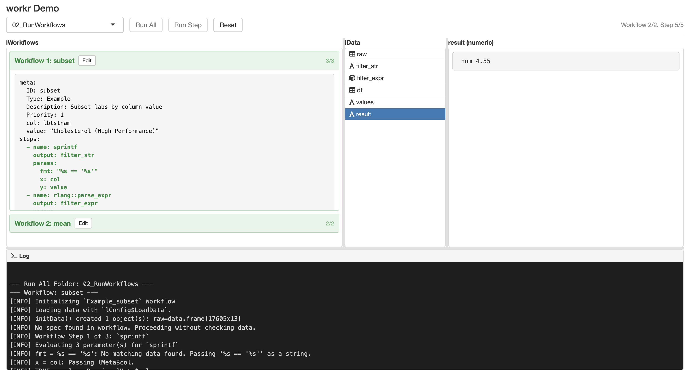

## That’s really about it

- Minimal mental model
- Easy to read / debug
- Surprisingly scalable

# Why {workr}? 

Scalable Clinical Trial Operations

## From Safety Monitoring ... 
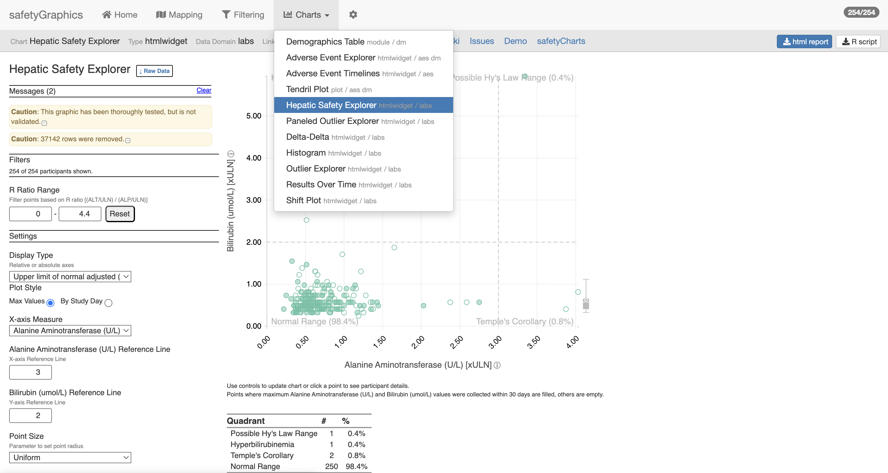

[{safetyGraphics}](https://github.com/SafetyGraphics)

## With gnarly data pipelines ... 


## To Risk-Based Quality Monitoring

- `{gsm}` (Good Statistical Monitoring) is a qualified set of R packages that provides a GxP framework for central monitoring in clinical trials.
- Designed to support a variety of business processes, from manually executed RBQM reporting to enterprise-wide monitoring platforms.

## Repeatability and scalability are key

- Data pipeline: 30 studies × monthly snapshots × 15 metrics × 5 steps
- ~27,000 metrics / year

## But Science is Hard 

Clinical trials are complex

- Study designs vary
- Metrics need tweaks
- Study-level (and sometimes metric-level) customization required

## 🚫 Custom Study Scripts 🚫 

- Needed reusable pipelines / workflows
- Existing tools felt a bit complicated (`targets`, `glue`, etc.)
- So we created `gsm::RunWorkflow()` in April 2022
- Migrated to `{workr}` for better modularity and extensibility

## {gsm} metrics 

{gsm} provides a framework that allows users to assess and visualize site-level risk in clinical trial data.

*12 Core Site KRIs*

::: {.columns style="font-size: 0.65em;"}
::: {.column width="50%"}
1. Adverse Event Reporting Rate
2. Serious Adverse Event Reporting Rate
3. Non-important Protocol Deviation Rate
4. Important Protocol Deviation Rate
5. Grade 3+ Lab Abnormality Rate
6. Study Discontinuation Rate
:::
::: {.column width="50%"}
7. Treatment Discontinuation Rate
8. Query Rate
9. Outstanding Query Rate
10. Outstanding Data Entry Rate
11. Data Change Rate
12. Screen Failure Rate
:::
:::

## Highly Standardized Metric Workflows


[Analysis Workflow Vignette](https://gilead-biostats.github.io/gsm.core/pr/129/dev/articles/DataAnalysis.html)


## <above>`workr::demoApp()`</above> Example 3: AE KRI Workflow 


## <above> {gsm} extensions </above> Reporting and Visualization Layer

- [Site KRI Report](https://gilead-biostats.github.io/gsm.kri/examples/Example_SiteReport.html)
- [Country KRI Report](https://gilead-biostats.github.io/gsm.kri/examples/Example_CountryReport.html)
- [Cross-Study KRI Report](https://gilead-biostats.github.io/gsm.kri/examples/Example_CrossStudySRS.html)
- [Eligibility Report](https://gilead-biostats.github.io/gsm.kri/examples/Example_Eligibility.html)
- [QTL Report](https://gilead-biostats.github.io/gsm.qtl/examples/Example_QTL.html)
- [{gsm} Deep Dive App](https://rinpharma.shinyapps.io/gsm-app/)


## Site KRI Report {.full-image-slide}

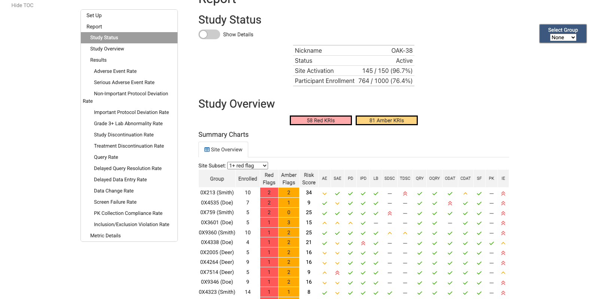{fig-alt="Site KRI Report screenshot"}

<p class="img-caption"><a href="https://gilead-biostats.github.io/gsm.kri/examples/Example_SiteReport.html">Open report</a></p>

## Country KRI Report {.full-image-slide}

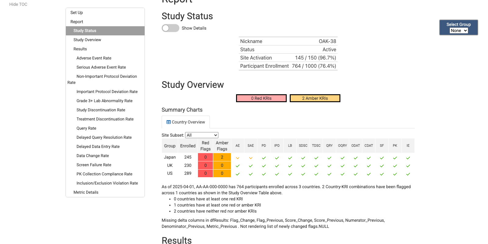{fig-alt="Country KRI Report screenshot"}

<p class="img-caption"><a href="https://gilead-biostats.github.io/gsm.kri/examples/Example_CountryReport.html">Open report</a></p>

## Cross-Study KRI Report {.full-image-slide}

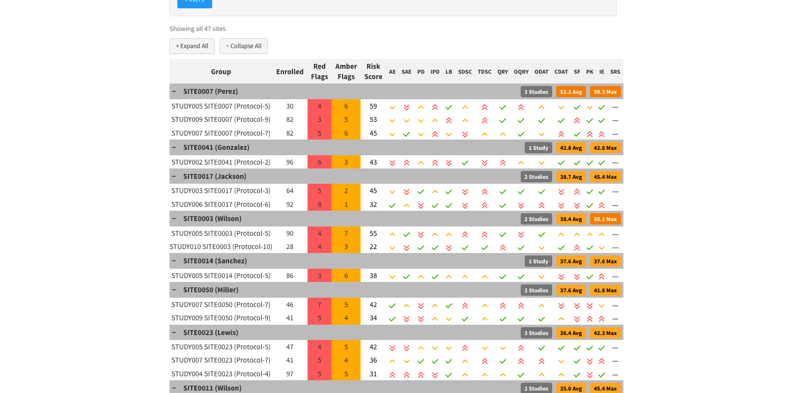{fig-alt="Cross-Study KRI Report screenshot"}

<p class="img-caption"><a href="https://gilead-biostats.github.io/gsm.kri/examples/Example_CrossStudySRS.html">Open report</a></p>

## Eligibility Report {.full-image-slide}

{fig-alt="Eligibility Report screenshot"}

<p class="img-caption"><a href="https://gilead-biostats.github.io/gsm.kri/examples/Example_Eligibility.html">Open report</a></p>

## QTL Report {.full-image-slide}

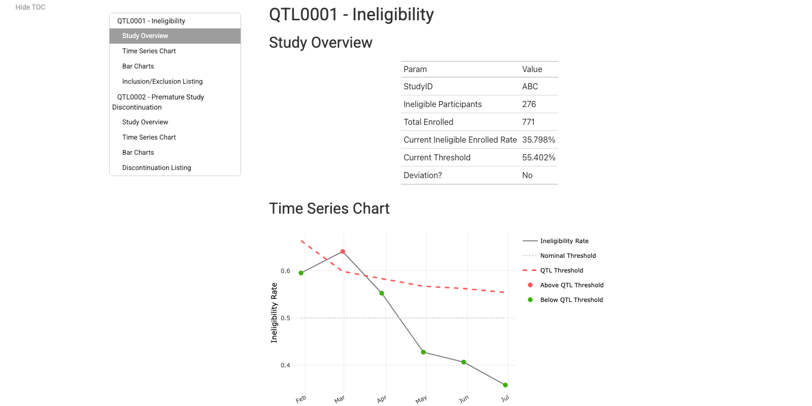{fig-alt="QTL Report screenshot"}

<p class="img-caption"><a href="https://gilead-biostats.github.io/gsm.qtl/examples/Example_QTL.html">Open report</a></p>

## {gsm} Deep Dive App {.full-image-slide}

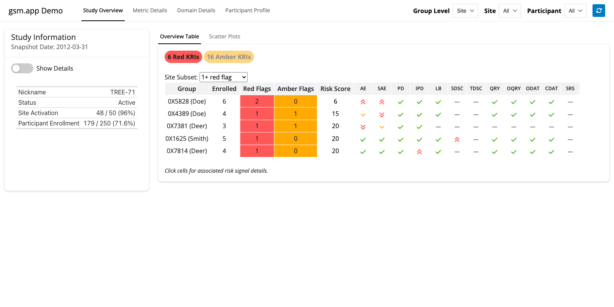{fig-alt="{gsm} Deep Dive App screenshot"}

<p class="img-caption"><a href="https://rinpharma.shinyapps.io/gsm-app/">Open app</a></p>

## Full {gsm} Data Model
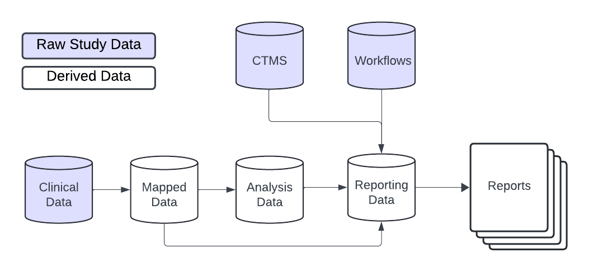

## {gsm} ❤️ {workr}

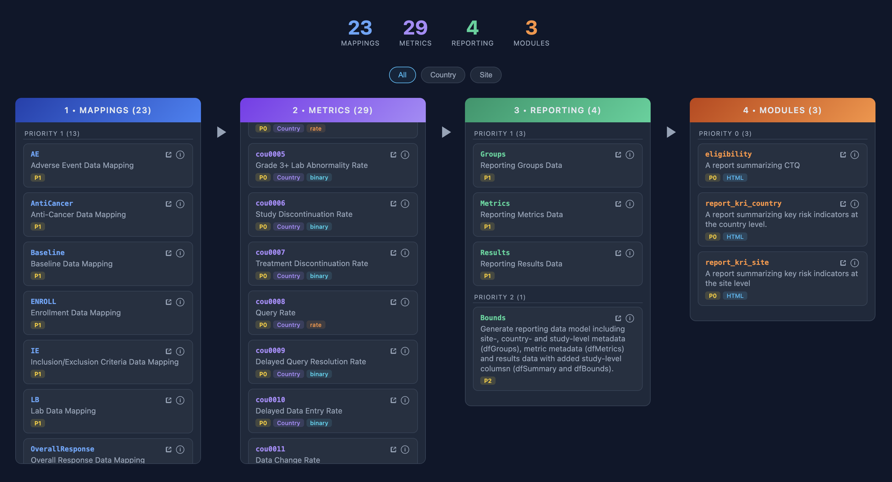

[open.gismo — explore this workflow explorer live →](https://gilead-biostats.github.io/open.gismo/)

## {gsm} + {workr} Study Operations

- `workr::snapshot()` combines workflows across packages
  - Quarterly snapshots of {gsm} workflows
  - `rv` for managing package versions
- GitHub repo for each study
  - Clone default workflows, customize as needed
- `workr::runProject()` runs folders of workflows
  - Schedule monthly and/or trigger as needed
  - Load/save hooks for preferred locations
    - folder, database, S3, etc.

## GxP Considerations

- Extensive qualification via [{qcthat}](https://github.com/Gilead-Public/qcthat)
- {workr}-driven Action Log 
  - SMEs assess and address detected risks
- In use on 20+ studies.

## San Antonio | 1:30-2:30 PM
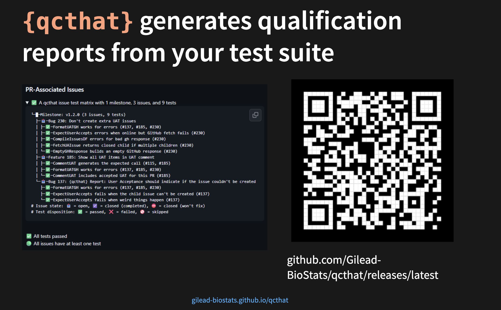

# {workr} ❤️ {pharmaverse}

Not just for ClinOps!

## From Raw to SDTM

- {sdtm.oak} is a popular R package that modularizes SDTM programming that is EDC/data-standards agnostic
- The algorithms and sub-algorithms provided can be reused across multiple SDTM domains 
- We aim to replicate the results of this [vignette](https://pharmaverse.github.io/sdtm.oak/articles/findings_domain.html) {width=150px}  using workflows!

## SDTM Example: RAW to VS {.step1-compare}

What you would run in R
```R
wf <- yaml::read_yaml(system.file("demo_gsmpharmaverse/workflows/1_RAW_TO_SDTM/VS.yaml"))
lData <- list(
  dm_raw = read.csv(system.file("raw_data/dm.csv", package = "sdtm.oak")),
  vs_raw =  read.csv(system.file("raw_data/vitals_raw_data.csv", package = "sdtm.oak")),
  study_ct = read.csv(system.file("raw_data/sdtm_ct.csv", package = "sdtm.oak"))
)
RunWorkflow(
  lWorkflow = wf,
  lData = lData
)
```

What's happening inside

::: {.columns}
::: {.column width="48%"}

```yaml
meta:
  ID: VS
  Type: SDTM
  Description: Transform Raw VS to SDTM VS following sdtm.oak article
  Priority: 1
spec:
  # Read in data
  vs_raw:
    _all:
      required: true
  study_ct:
    _all:
      required: true
steps:
  # Create oak_id_vars
  - output: vs_raw2
    name: sdtm.oak::generate_oak_id_vars
    params:
      raw_dat: vs_raw
      pat_var: "PATNUM"
      raw_src: "vitals"
```
:::


::: {.column width="4%"}
=
:::
::: {.column width="48%"}
```R
lData$vs_raw2 <- generate_oak_id_vars(
  raw_dat = lData$vs_raw,
  pat_var = "PATNUM",
  raw_src = "vitals"
)
```
:::
:::

## SDTM Example: Naming convention considerations

```R
# lData after Step 1
list(
    vs_raw = {THE RAW DATASET}
    vs_raw2 = {THE RAW DATASET after we ran generate_oak_id_vars}
)
```
It is important to define how interim objects are handled within `lData`. As in pipe-based workflows (`%>%` and `|>`), teams can either preserve each step by assigning a new output name or overwrite the existing object; in this example, that means choosing vs_raw2 for traceability or overwriting `vs_raw`.

## SDTM Example: CT assignment Steps {.ct-compare}

::: {.columns}
::: {.column width="50%"}
Using workflows
```yaml
  # Map topic variable SYSBP and its qualifiers.
  - output: vs_sysbp
    name: sdtm.oak::hardcode_ct
    params:
      raw_dat: vs_raw
      raw_var: "SYS_BP"
      tgt_var: "VSTESTCD"
      tgt_val: "SYSBP"
      ct_spec: study_ct
      ct_clst: "C66741"
  - output: vs_sysbp
    name: workr::RunQuery
    params:
      df: vs_sysbp
      strQuery: "SELECT * FROM df WHERE VSTESTCD IS NOT NULL"
  # Map topic variable SYSBP and its qualifiers.
  - output: vs_sysbp
    name: sdtm.oak::hardcode_ct
    params:
      tgt_dat: vs_sysbp
      raw_dat: vs_raw
      raw_var: "SYS_BP"
      tgt_var: "VSTEST"
      tgt_val: "Systolic Blood Pressure"
      ct_spec: study_ct
      ct_clst: "C67153"
  - output: vs_sysbp
    name: sdtm.oak::assign_no_ct
    params:
      tgt_dat: vs_sysbp
      raw_dat:  vs_raw
      raw_var: "SYS_BP"
      tgt_var: "VSORRES"
```
:::

::: {.column width="50%"}
Using pipes

```r
# Map topic variable SYSBP and its qualifiers.
vs_sysbp <-
  hardcode_ct(
    raw_dat = vs_raw,
    raw_var = "SYS_BP",
    tgt_var = "VSTESTCD",
    tgt_val = "SYSBP",
    ct_spec = study_ct,
    ct_clst = "C66741"
  ) %>%
  dplyr::filter(!is.na(.data$VSTESTCD))  %>%
  hardcode_ct(
    raw_dat = vs_raw,
    raw_var = "SYS_BP",
    tgt_var = "VSTEST",
    tgt_val = "Systolic Blood Pressure",
    ct_spec = study_ct,
    ct_clst = "C67153",
    id_vars = oak_id_vars()
  ) %>%
  assign_no_ct(
    raw_dat = vs_raw,
    raw_var = "SYS_BP",
    tgt_var = "VSORRES",
    id_vars = oak_id_vars()
  )
```
:::
:::

Each pipe statement is equivalent to a step in the workflow; integration of any package would mostly be depend on familiarity with a particular R Package, not necessarily this workr framework.

## From SDTM to ADaM

- {admiral} is a popular R package that modularizes ADaM programming with many extension packages that address specific therapeutic area needs
- Here we'll highlight just a few specific functions, but the documentation and user guides for {admiral} are some of the best amongst all R packages

## ADaM Example: VS to ADVS (add MAP) {.step1-compare}

What you would run in R

```R
wf <- yaml::read_yaml(system.file("demo_gsmpharmaverse/workflows/2_SDTM_TO_ADAM/ADVS.yaml"))
sdtm <- list(
  SDTM_DM = arrow::read_parquet(system.file("demo_gsmpharmaverse/data/SDTM/SDTM_DM.parquet", package = "workr")),
  SDTM_VS = arrow::read_parquet(system.file("demo_gsmpharmaverse/data/SDTM/SDTM_VS.parquet", package = "workr"))
)
RunWorkflow(lWorkflow = wf, lData = sdtm)
```

What's happening inside

::: {.columns}
::: {.column width="48%"}

```yaml
meta:
  ID: ADVS
  Type: ADAM
  Description: Create Basic ADVS
  Priority: 1
spec:
  SDTM_DM:
    _all:
      required: true
  SDTM_VS:
    _all:
      required: true
steps:
  - output: advs
    name: admiral::derive_vars_merged
    params:
      dataset: SDTM_VS
      dataset_add: SDTM_DM
      new_vars: !expr exprs(TRT01A)
      by_vars: !expr exprs(STUDYID, USUBJID)
  - output: advs
    name: dplyr::mutate
    params:
      .data: advs
      PARAMCD: !expr rlang::expr(.data[["VSTESTCD"]])
      AVAL: !expr rlang::expr(.data[["VSORRES"]])
  - output: advs
    name: admiral::derive_param_map
    params:
      dataset: advs
      by_vars: !expr exprs(STUDYID, USUBJID, TRT01A, VSDTC, VISIT, VISITNUM, VSTPT, VSTPTNUM)
      sysbp_code: 'SYSBP'
      diabp_code: 'DIABP'
      get_unit_expr: !expr rlang::expr(.data[["VSORRESU"]])
```
:::

::: {.column width="4%"}
=
:::

::: {.column width="48%"}

```R
advs <- admiral::derive_vars_merged(
    dataset = SDTM_VS,
    dataset_add = SDTM_DM,
    new_vars =  exprs(TRT01A),
    by_vars =  exprs(STUDYID, USUBJID)
  ) %>% 
  mutate(
    PARAMCD = VSTESTCD,
    AVAL = VSORRES
  ) %>% 
  derive_param_map(
    by_vars = exprs(STUDYID, USUBJID, TRT01A, VSDTC, VISIT, VISITNUM, VSTPT, VSTPTNUM),
    sysbp_code = 'SYSBP',
    diabp_code = 'DIABP',
    get_unit_expr = VSORRESU
  )
```
:::
:::

## ADaM Example: Create MAP {.adam-map-notes}

- The prior examples establish a consistent workflow pattern for producing an ADaM dataset. In this step, `derive_param_map()` derives mean arterial pressure (MAP) from `SYSBP` and `DIABP`.
- Compared with stitching together multiple tidyverse transformations, this approach reduces boilerplate and makes the derivation intent clearer.
- A valuable area for future collaboration, particularly in admiral, is harmonizing quasiquotation patterns to improve readability and adoption, especially around `expr()`, `exprs()`, and `!!`.

## From ADaM to TFL

- How every team/organization handles data visualizations may just have the most variance
- We will go over a way that uses a workflow to render Rmarkdown documents with prespecified templates for tables/figures, specifically using `gtsummary` and `safetyCharts`
- The setup for this would be applicable for shiny apps, static reports, web-based html reports, where to host or view the final object is left to the user

## TFL Example: ADVS to TFL {.step1-compare}

What you would run in R
```r
wf <- yaml::read_yaml(system.file("demo_gsmpharmaverse/workflows/3_ADAM_TO_TFL/WorkProduct1.yaml", package = "workr"), warn = FALSE)
adam <- list(
  ADVS = arrow::read_parquet(system.file("demo_gsmpharmaverse/data/ADAM/ADAM_ADVS.parquet", package = "workr"))
)
workr::RunWorkflows(lWorkflows = wf, lData = adam )
```

What's happening inside

::: {.columns}
::: {.column width="48%"}

```yaml
meta:
  ID: WorkProduct1
  Type: TFL
  Description: Create Basic Work Product/Report which can modularize the tables included
  Priority: 1
spec:
  ADVS:
    _all:
      required: true
steps:
  - output: lParams
    name: list
    params:
      'dfADVS': ADVS
  - output: table1
    name: rmarkdown::render
    params:
      input: !expr  here::here("demo_gsmpharmaverse", "report_templates", "WorkProduct1.Rmd")
      output_file: !expr   here::here("demo_gsmpharmaverse", "TFLS", "WorkProduct1.html")
      envir: !expr new.env(parent = globalenv())
      params: lParams
```
:::

::: {.column width="4%"}
=
:::

::: {.column width="48%"}

```R
lParams <- list(dfADVS = arrow::read_parquet(system.file("demo_gsmpharmaverse/data/ADAM/ADAM_ADVS.parquet", package = "workr")))
table1 <- rmarkdown::render(
  input = here::here("demo_gsmpharmaverse", "report_templates", "WorkProduct1.Rmd"),
  output_file = here::here("demo_gsmpharmaverse", "TFLS", "WorkProduct1.html"),
  envir = new.env(parent = globalenv()),
  params = lParams
)
```
:::
:::

## TFL Preview
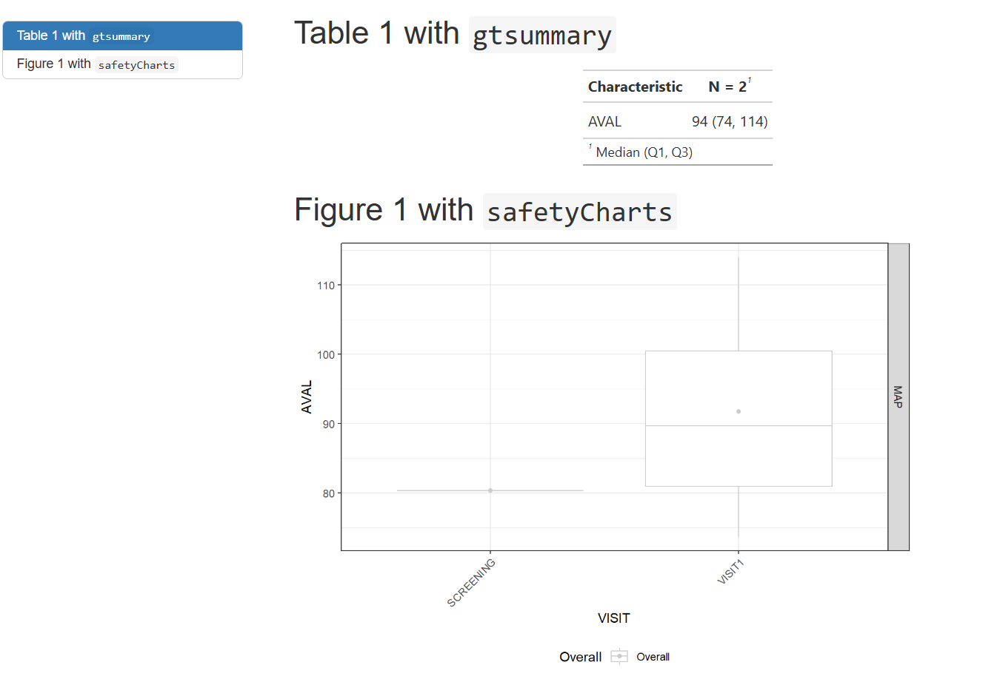

## TFL Example: Render Rmarkdown (2) {.tfl-rmd-notes}

- These rendered documents (html in this case) can be mounted into a preferred viewing environment (r shiny apps, websites, pdf over email, etc.) for whoever the end user may be. 
- The methodology & technical infrastructure will be left to the user.

::: {.columns}
::: {.column width="50%"}
Parent Rmd
{width=82%}
:::
::: {.column width="50%"}
Child Rmd

::: 
::: 

## TFL Overview

- Using smaller child .Rmds that may match a respective company standard table/figure template may be favorable in this scenario
- This allows a larger work product/bundle to be stitched together with these child rmarkdowns to reduce clutter of the main document.
- For some deliveries it may be necessary to only have a few tables and figures, and other deliveries a much heftier report. This framework allows a "lego set" style assembled work deliverable in a pick and choose fashion

## From ADaM to ARS/ARD

- {cards} is an R package for creating CDISC Analysis Results Data (ARD)

- It is designed to support automation, reproducibility, reusability, and traceability of analysis results

## ARS/ARD Example: ADVS summary {.step1-compare}

What you would run in R
```R
wf <- yaml::read_yaml(system.file("demo_gsmpharmaverse/workflows/3_ADAM_TO_ARS/table_mean_arterial_pressure.yaml"))
adam <- list(
  ADVS = arrow::read_parquet(system.file("demo_gsmpharmaverse/data/ADAM/ADAM_ADVS.parquet", package = "workr"))
)
workr::RunWorkflows(lWorkflows = wf, lData = adam )
```

What's happening inside

::: {.columns}
::: {.column width="48%"}

```yaml
meta:
  ID: table_mean_arterial_pressure
  Type: ars
  Description: Create table 1 ARS
  Priority: 1
spec:
  ADVS:
    _all:
      required: true
steps:
  - output: predose_visit1_map
    name: workr::RunQuery
    params:
      df: ADVS
      strQuery: "SELECT * FROM df WHERE PARAMCD = 'MAP' AND VISIT = 'VISIT1' AND VSTPT = 'PREDOSE'"
  - output: table_predose_visit1_map
    name: cards::ard_summary
    params:
      data: predose_visit1_map
      variables:
        - AVAL
```
:::

::: {.column width="4%"}
=
:::

::: {.column width="48%"}

```R
table_predose_visit1_map  <- adam$ADVS %>% 
  filter(PARAMCD == 'MAP', VISIT == 'VISIT1', VSTPT == 'PREDOSE') %>% 
  cards::ard_summary(variables = c(AVAL))
```
:::
:::

## Final Considerations

- The primary outputs (thus far) of these workflows is typically a derived dataset, but persistence (load/save) is intentionally decoupled

- Workflows orchestrate transformation logic; storage strategy is flexible and left to the user/organization

- Saving outputs (e.g., .csv, .parquet, .json, or a data lake) can be implemented as an additional workflow step/configuration

# {workr} Apps

## Color demo

{width=450px}

[Live Demo](https://zeloszhu.shinyapps.io/color-demo-presenter/)

## <above> Enterprise {workr} Platform </above> gismo 

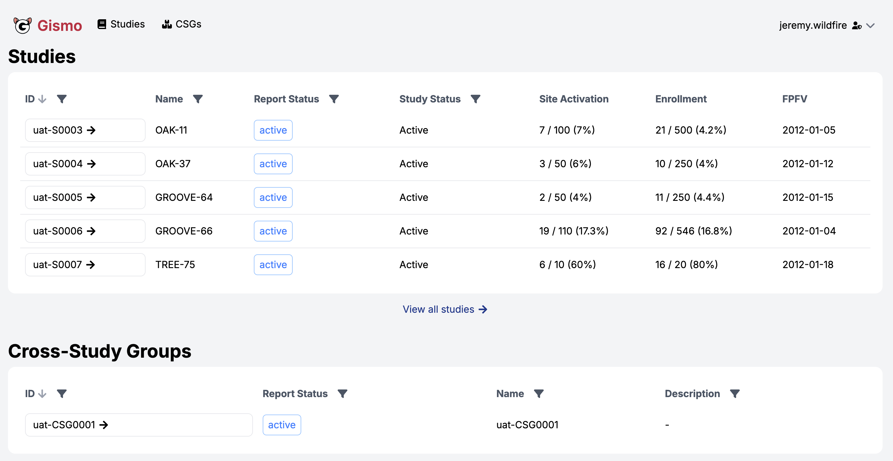

## <above> Enterprise {workr} Platform </above> gismo 

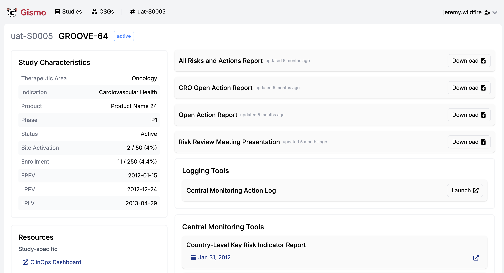


## <above> Enterprise {workr} Platform </above> gismo 

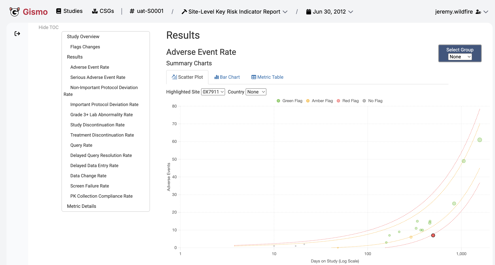

## <above> Enterprise {workr} Platform </above> gismo 

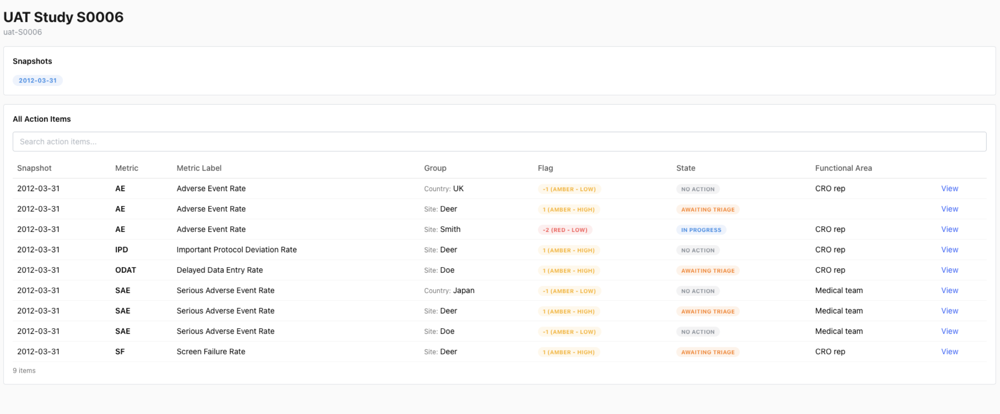


## <above> Enterprise {workr} Platform </above> gismo 

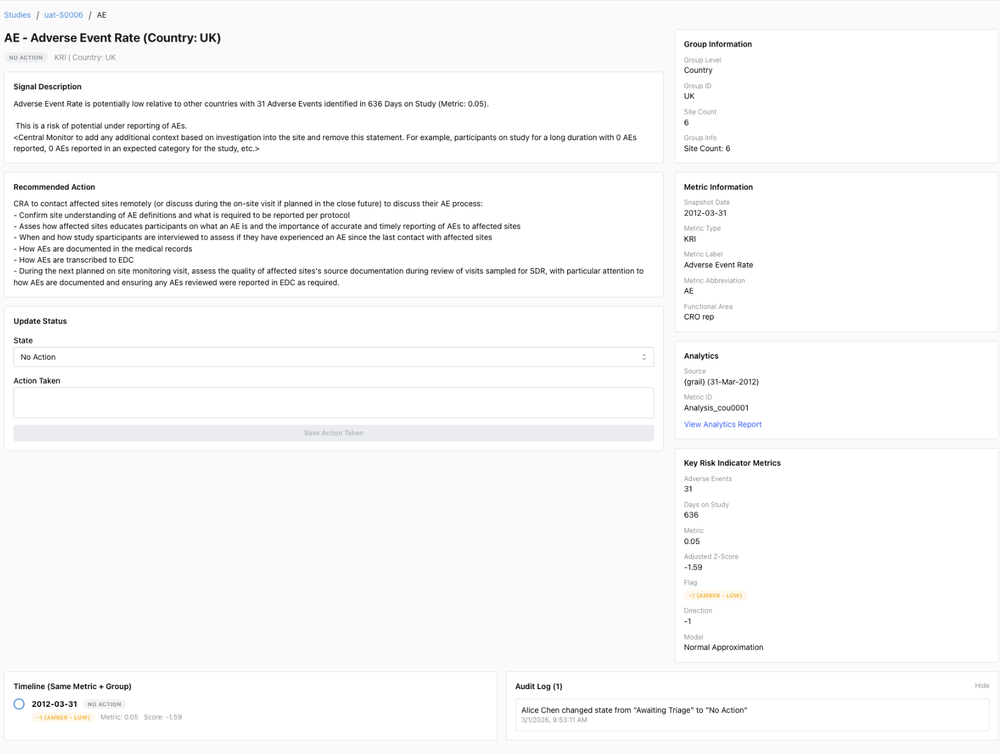

## <above> GitHub {workr} Platform </above> open.gismo

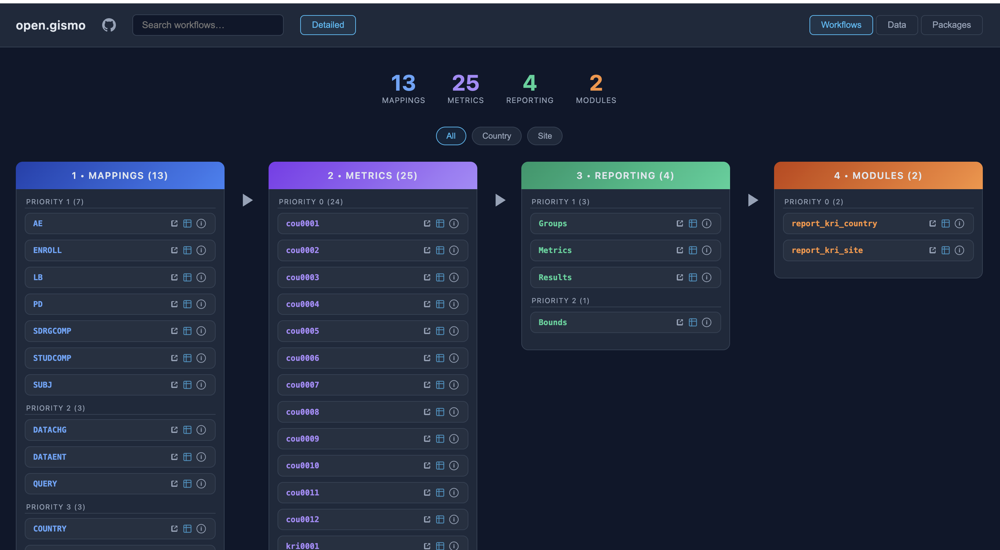

[open.gismo demo](https://gilead-biostats.github.io/open.gismo/)


## <above> GitHub {workr} Platform </above> open.gismo

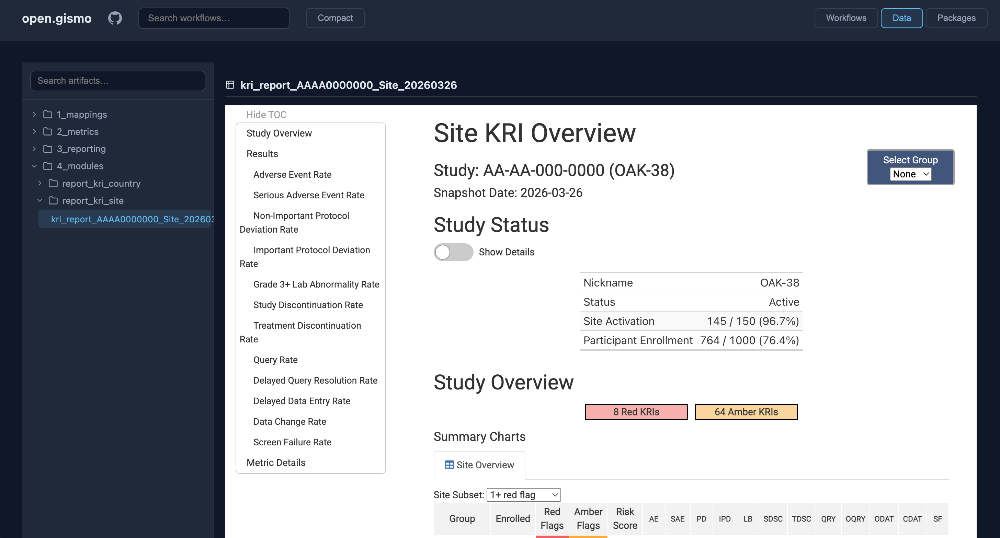

[open.gismo demo](https://gilead-biostats.github.io/open.gismo/)

# {workr} ❤️ 🤖

- Designed for use with Agentic AI
- Breaks down complex tasks into modular steps 
- Agents can generate and execute workflows
- {gsm} and {workr} skills coming soon!

# {workr} 🙏 you!

- Simple R workflows
- Highly scalable and flexible
- Designed for GxP use
- Open source and extensible

