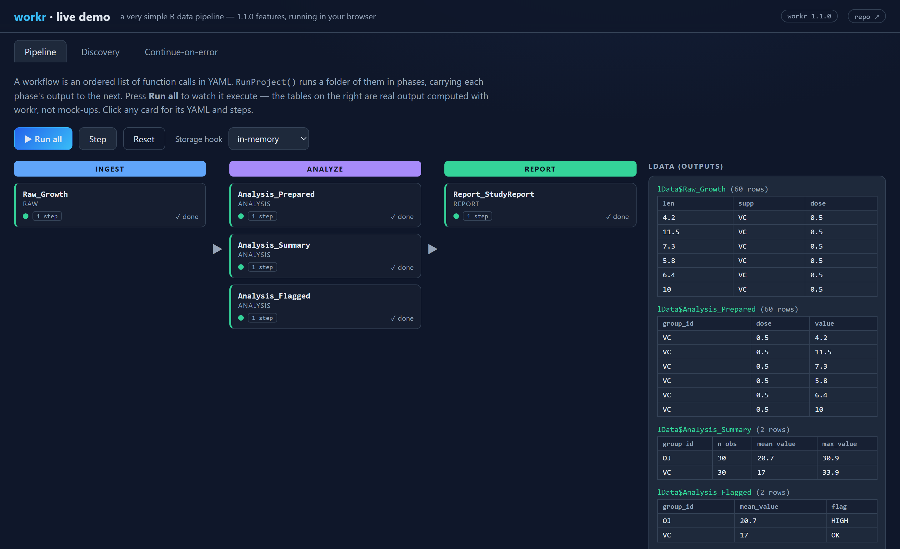
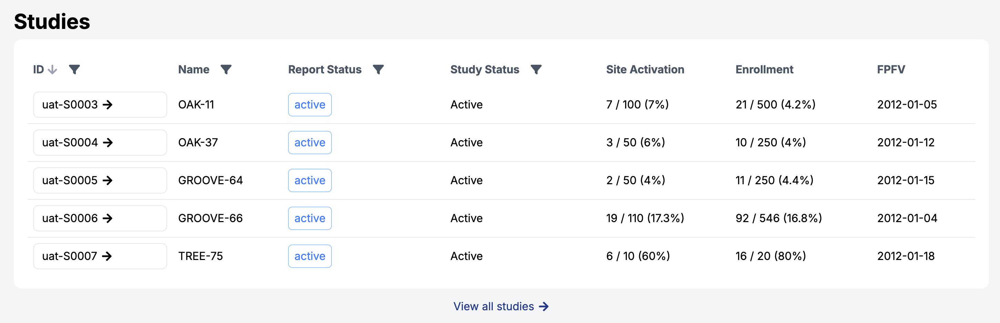
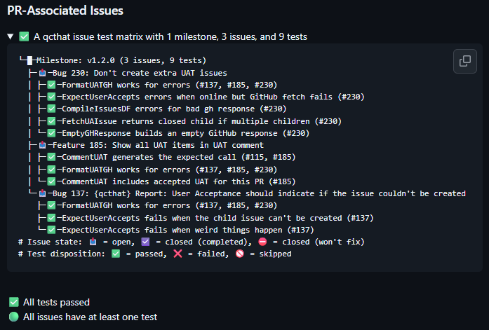

## {.center}

::: {style="font-size: 1.3em; line-height: 1.3;"}
Most data pipelines are an ordered
list of function calls.

{workr} takes that literally.
:::

::: {.notes}
30-min talk + 10-min Q&A. The framing, stated plainly. The next 20 minutes show
the idea holds up at three scales: a toy calc, a regulated production system,
and the whole pharmaverse stack. Timing: intro ~3, scale ~7, pharmaverse ~7,
AI + what's new ~2, close ~1.
:::

## The model

::: {.tocbox}
- A **workflow** is a YAML list of function calls
- **`lData`** flows through every step and is updated as it goes
- **`workr::RunWorkflow()`** runs the list and returns the last result
:::

::: {.notes}
The contract, before any syntax: a workflow is an ordered list of function
calls; `lData` is the shared bag of data that each step reads from and writes
back to; `RunWorkflow()` executes the list. `RunWorkflows()` (plural) chains
workflows, feeding each output into the next `lData`. Keep it brief — the next
slide makes it concrete.
:::

## A complete pipeline

```{.yaml code-line-numbers="|2-4|5-19|"}
# hello_cars.yaml
meta:
  ID: hello_cars
  col: speed
steps:
  - name: get                 # load a dataset
    output: df                # -> lData$df
    params:
      x: "cars"
  - name: dplyr::pull         # pull one column
    output: speed             # -> lData$speed
    params:
      .data: df
      var: col                # meta$col == "speed"
  - name: mean                # summarize it
    output: result            # -> lData$result
    params:
      x: speed
```

::: {.notes}
Now the same contract as a real file — the bundled example from
inst/example_workflows/01_RunWorkflow. Reveal 1: the whole file. Reveal 2:
`meta` is the metadata you just described. Reveal 3: `steps` is the ordered list
of calls, each with an `output` that lands in `lData`. Nothing here that wasn't
on the previous slide.
:::

## Configuration, not code {.full-image-slide .has-qr}

{fig-alt="Live demo app: a three-phase workflow project after running, with real output tables in lData"}

<p class="img-caption"><span>Scan to run the pipeline yourself — <a href="https://zeloszhu.com/workr_demoapp/">zeloszhu.com/workr_demoapp</a></span></p>

::: {.notes}
Live demo moment. Press **Run all**: each workflow card goes grey → running →
green, and the real output tables stream into `lData` on the right (these are
genuine workr results, not mock-ups). **Step** walks one workflow at a time.

Things to point at while it runs:
- the three phases — `RunProject()` carrying output forward
- the **Storage hook** selector — foreshadows the load/save hooks slide
- the **Discovery** and **Continue-on-error** tabs — we come back to both

The point: the logic is data you can edit, diff, and review rather than a script
you rewrite. Declarative definitions are easier for others to trust and audit.
Runs entirely in the browser, so it can't fail on conference wifi.
:::

# Does this scale? {.center}

## The reason {workr} exists

::: {style="font-size: 1.05em; line-height: 1.4;"}
30 studies × monthly snapshots
× 15 metrics × 5 steps
:::

::: {style="font-size: 1.5em; margin-top: 0.35em;"}
≈ 27,000 metrics / year
:::

::: {style="font-size: 0.68em; opacity:0.8; margin-top:0.5em;"}
…each one regulated, GxP output. Study designs vary, so metrics need
per-study tweaks — a hand-written script per study didn't hold up.
:::

::: {.notes}
~4:00. You cannot hand-audit tens of thousands of bespoke scripts a year. You
can audit one framework plus many small configs. This is the whole motivation.
:::

## A real metric is the same shape {.smaller}

```{.yaml code-line-numbers="|2-11|12-27|"}
meta:
  ID: kri0001
  Metric: Adverse Event Rate
  Numerator: Adverse Events
  Denominator: Days on Study
  Model: Normal Approximation
  Threshold: -2,-1,2,3
steps:
  - name: gsm.core::ParseThreshold   # ...
  - name: gsm.core::Input_Rate       # numerator / denominator
  - name: gsm.core::Transform_Rate
  - name: gsm.core::Analyze_NormalApprox
  - name: gsm.core::Flag             # apply thresholds
  - name: gsm.core::Summarize
```

::: {style="font-size:0.62em; opacity:0.85;"}
Real KRI from `{gsm}` — `gsm.kri/inst/workflow/2_metrics/kri0001.yaml` (params trimmed to fit).
:::

::: {.notes}
The metric is expressed almost entirely through `meta`; the `steps` are the
same canonical gsm.core pipeline (Input → Transform → Analyze → Flag →
Summarize) for every KRI. Swap the params, get a different metric.
:::

## One report — every metric, every site {.full-image-slide}

{fig-alt="Site-level KRI report with red/amber flags across metrics"}

<p class="img-caption">Each column (AE, SAE, PD, LB, …) is a workflow like the last slide. Every site. Every month.</p>

::: {.notes}
This is the payoff of the 27k number made visual: one study's site-level risk
report, all KRIs at once, red/amber flags and risk scores. The columns map
one-to-one to metric workflows.
:::

## …and across the whole portfolio {.full-image-slide}

{fig-alt="Portfolio view listing many studies"}

<p class="img-caption">Same framework, many studies — now running on 20+ studies in production.</p>

::: {.notes}
The origin story in one breath: began as `gsm::RunWorkflow()` in April 2022,
built in a few hours as a stopgap, later extracted into standalone {workr}.
gsm.core still ships the same engine; newer packages call `workr::` directly —
evidence the idea generalized.
:::

## Qualify the framework once {.center}

{width=62% fig-alt="qcthat qualification report: issues linked to tests"}

::: {style="font-size:0.62em; opacity:0.85; margin-top:0.2em;"}
[{qcthat}](https://github.com/Gilead-Public/qcthat) links requirements to tests — qualify one framework, not 27,000 scripts.
:::

::: {.notes}
The GxP beat. qcthat produces a qualification report tying GitHub issues
(requirements) to the tests that satisfy them. Qualifying the framework once is
what makes the scale claim viable in a regulated setting.
:::

# The same approach across {pharmaverse} {.center}

::: {style="opacity:0.8; font-size:0.85em;"}
not only clinical operations
:::

::: {.notes}
~11:00. Second point: breadth. The workflow shape maps onto the standard
clinical data flow, and none of it is workr-specific.
:::

## One pattern, the whole clinical stack {.center}

::: {style="font-size: 1.15em; line-height: 1.5;"}
**RAW** → **SDTM** → **ADaM** → **TFL / ARD**
:::

::: {style="font-size: 0.78em; opacity: 0.85; margin-top: 0.6em;"}
`{sdtm.oak}` · `{admiral}` · `{rmarkdown}` · `{cards}`
:::

::: {.notes}
Each arrow is more steps. Each package is a set of functions, and a function
call is a step — so the packages you already know are the pipeline. Real demo
tree: workr/inst/demo_gsmpharmaverse/workflows.
:::

## A step is a function call {.step1-compare}

::: {.columns}
::: {.column width="52%"}
Workflow step
```yaml
steps:
  - output: vs_raw
    name: sdtm.oak::generate_oak_id_vars
    params:
      raw_dat: vs_raw
      pat_var: "PATNUM"
      raw_src: "vitals"
```
:::
::: {.column width="4%"}
=
:::
::: {.column width="44%"}
Plain R
```R
vs_raw <-
  generate_oak_id_vars(
    raw_dat = vs_raw,
    pat_var = "PATNUM",
    raw_src = "vitals"
  )
```
:::
:::

Adopting a package is mostly about knowing that package, not learning {workr}.

::: {.notes}
The anchor slide for this section: show one mapping in full so the equivalence
is clear, then let the audience extrapolate the rest. Verbatim from
1_RAW_TO_SDTM/VS.yaml.
:::

## The rest of the stack follows the same form {.smaller}

| Stage | Package | A representative step |
|---|---|---|
| SDTM → ADaM | `{admiral}` | `admiral::derive_param_map()` → MAP from SYSBP/DIABP |
| ADaM → TFL | `{rmarkdown}` | `rmarkdown::render()` a parameterized template |
| ADaM → ARD | `{cards}` | `cards::ard_summary()` for CDISC Analysis Results Data |

::: {style="font-size:0.72em; opacity:0.85; margin-top:0.4em;"}
`!expr` carries quasiquotation (`exprs()`, `!!`) directly into a step's params.
:::

::: {.notes}
This condenses what used to be three near-identical YAML-vs-R slides. Depth on
any row is available in Q&A and in the long-form Phuse Connect deck.
:::

## Example: an ARD in two steps {.center}

```yaml
steps:
  - output: predose_visit1_map
    name: workr::RunQuery        # SQL over a data.frame
    params:
      df: ADVS
      strQuery: >
        SELECT * FROM df
        WHERE PARAMCD = 'MAP'
          AND VISIT = 'VISIT1'
          AND VSTPT = 'PREDOSE'
  - output: table_predose_visit1_map
    name: cards::ard_summary     # CDISC Analysis Results Data
    params:
      data: predose_visit1_map
      variables:
        - AVAL
```

::: {style="font-size:0.6em; opacity:0.85;"}
Verbatim from `demo_gsmpharmaverse/workflows/3_ADAM_TO_ARS/table_mean_arterial_pressure.yaml`.
:::

::: {.notes}
Filter with a workr-native SQL step, then summarize with cards into an ARD. Two
steps, one regulatory-grade result. RunQuery requires the literal `FROM df`.
:::

## Where it lands is your call

- Workflows orchestrate transformation; saving is deliberately decoupled
- Writing to csv / parquet / json / a data lake is another step
- The same workflow can feed a Shiny app, a static site, or a PDF over email

::: {.notes}
Don't overclaim on storage — it's intentionally left to the organization. The
framework ends at "here is the derived object."
:::

# A side effect: it works well with AI {.center}

::: {style="opacity:0.8; font-size:0.85em;"}
a workflow is data, not code
:::

::: {.notes}
~18:00. We built workr for auditability. Because the logic is inspectable data,
it also turned out to fit agentic AI well — for the same reason.
:::

## Agents can read and write workflows

::: {.columns}
::: {.column width="50%"}
**Read**

- Explain a workflow step by step
- Diff two runs and locate the change
- Debug a failure in plain language
:::
::: {.column width="50%"}
**Write**

- Draft a new workflow from a request
- Add or reorder steps safely
- {gsm} + {workr} skills coming soon
:::
:::

The properties that make a workflow auditable also make it legible to a model.

::: {.notes}
Modular, inspectable steps are what agents handle well. A benefit we noticed
after the fact, not the original design goal.
:::

## Seen this talk before? What changed in 1.1.0 {.smaller}

::: {.columns}
::: {.column width="50%"}
**Then (1.0)**

- `RunWorkflow()` / `RunWorkflows()`
- Point them at a folder of YAML
- Storage wired into your own script
:::
::: {.column width="50%"}
**New in 1.1.0**

- `RunProject()` — multi-phase runs
- Load/save **hooks** — storage decoupled
- Workflow **discovery** — active/inactive, priority, exact-name
:::
:::

::: {style="font-size:0.72em; opacity:0.85; margin-top:0.5em;"}
The model is unchanged. What's new is running it as a real, scheduled,
restartable production pipeline.
:::

::: {.notes}
This slide is for the returning audience. Nothing about the core idea changed;
1.1.0 is about operating it at scale. The next two slides show the two headline
additions.
:::

## New: `RunProject()` runs phases in order {.smaller}

::: {.columns}
::: {.column width="46%"}
```r
# project/
#   01_mapping/
#   02_analysis/
#   03_reporting/
workr::RunProject(
  strPath = "project",
  bContinueOnError = TRUE
)
```
Each subfolder is a **phase**; outputs carry forward to the next.
:::
::: {.column width="54%"}
```yaml
# 03_reporting/_config.yaml
input:
  from_phases: [01_mapping]
  from_results:
    lAnalyzed: 02_analysis
output:
  wrap_as: lReports
```
A `_config.yaml` shapes exactly what each phase receives and exposes.
:::
:::

::: {style="font-size:0.68em; opacity:0.85; margin-top:0.3em;"}
`bContinueOnError` records failures and keeps going — restartable, multi-phase runs.
:::

::: {.notes}
This is the 4-layer gsm pipeline (mapping → metrics → reporting → modules)
expressed as one project. New in 1.1.0: phases, per-phase config, and
continue-on-error. Verbatim from the README.
:::

## New: storage is a hook, not a rewrite {.smaller}

```r
workr::RunWorkflow(
  lWorkflow = wf,
  lConfig = list(LoadData = "gsm.datasim")   # a registered provider, by name
)

workr::register_save_provider("github_artifact", my_saver)  # or bring your own
```

- Built-in **GitHub Actions artifact** providers pass data between runs
- Same workflow, different storage — no change to the steps

::: {style="font-size:0.6em; opacity:0.85; margin-top:0.3em;"}
Live walkthrough of all of this:
[zeloszhu.com/workr_demoapp](https://zeloszhu.com/workr_demoapp/) ·
[source](https://github.com/zdz2101/workr_demoapp)
:::

::: {.notes}
Previously load/save was left entirely to your script; now it's a first-class,
swappable hook (`register_load_provider` / `register_save_provider`), referenced
by name via `lConfig`. The `gsm.datasim` provider ships built in. The demo repo
has a two-job GitHub Actions workflow showing the artifact round-trip end to end.
:::

# Thank you {.center}

::: {style="font-size:0.8em; opacity:0.9; margin-top:0.6em;"}
Simple, scalable, GxP-ready, open source

[gilead-public.github.io/workr](https://gilead-public.github.io/workr/)
:::

::: {style="font-size:0.72em; opacity:0.85; margin-top:0.8em;"}
Try the live demo → [zeloszhu.com/workr_demoapp](https://zeloszhu.com/workr_demoapp/)


:::

::: {.notes}
Hand to Q&A. Deep-dive material — the full data model, the gsm report gallery,
the enterprise platform, and open.gismo — is in the long-form Phuse Connect
deck if questions go there.
:::
