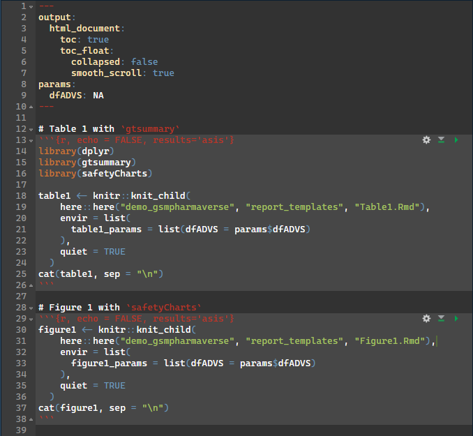
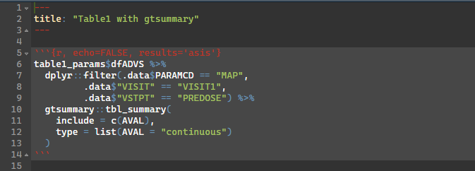

## Agenda

- What is {workr}?
- Why did we build this?
- {workr} ❤️ {pharmaverse}
- Automating {workr} 🤖

# What is {workr}? {background-color="#f0f0f0"}

A **very** simple R data pipeline 
<br>
<small>(almost too simple?)</small>

::: {.notes}
TODO: Add hex logo when available
:::

## {workr} workflows have `meta` and `steps`

```yaml
# hello_cars.yaml
meta:
  ID: hello_cars
  col: speed
steps:
  - name: dplyr::pull 
    output: speed
    params:
      df: df
      col: col
  - name: mean
    output: result
    params:
      lData: speed
```

## `workr::RunWorkflow()`

- Pass in your workflow and a list of data (`lData`)
- Each step runs a function (`step$name`) that updates `lData`
- Steps can use `meta` and `lData` as inputs
- Returns result of last step by default (can be customized)

## Example 1: Hello Cars 

```R
wf <- yaml::read_yaml("hello_cars.yaml")
lData <- list(df = cars)
RunWorkflow(
    lWorkflow = wf,
    lData = lData
)
```

## Example 1: Hello Cars - Step 1

```yaml
meta:
  ID: hello_cars
  col: speed
steps:
  - name: dplyr::pull # function to be called
    output: speed # output saved as `lData$speed`
    params:
      df: df # `lData$df` (`cars`)  passed as `df` argument
      col: col # `meta$col` (`"speed"`) passed as `col` argument
  - ...
``` 
`lData$speed <- dplyr::pull(df=cars, col="speed")`

```R
# lData after Step 1
list(
    df = cars, 
    speed = c(4, 4, ...)
)
```

## Example 1: Hello Cars - Step 2

```yaml
    ...
    - name: mean        # function to be called
      output: result    # output saved as `lData$result`
      params:
        lData: speed    # `lData$speed` passed as `lData` argument
```

```lData$result <- mean(lData$speed)```
<br>
<small>Basically ```mean(cars$speed)```</small>

```R
# lData after Step 2
list(
    df = cars, 
    speed = c(4, 4, ...), 
    result = 15.4
)
```
`RunWorkflow()` returns: 15.4
<br>
<small>Return full workflow object with: `RunWorkflow(bReturnResult = FALSE)`</small>

## Example 1b: Hello Iris
```R
wf$meta$col <- "dist"
RunWorkflow(wf, lData)
```

- Returns: 42.98 (`mean(cars$dist)`)

```R
lData$df <- iris
wf$meta$col <- "Sepal.Length"
RunWorkflow(wf, lData)
```

- Returns: 5.84 (`mean(iris$Sepal.Length)`)

## `workr::RunWorkflows()`

- Convenience function to run multiple workflows in sequence
- Output of each workflow added to `lData` for the next workflow

## Example 2: Avg. Lab Values - Subset

```yaml
# subset.yaml
meta:
  ID: subset
  meta: 
    col: param
    value: cholesterol
steps:
  - name: dplyr::filter
    output: df
    params:
        df: raw
        expr: !!expr(!!rlang::sym(meta$col) == meta$value)
``` 

## Example 2: Avg. Lab Values - Subset + Mean

```R
sub_wf <- yaml::read_yaml("subset.yaml")
mean_wf <- yaml::read_yaml("hello_cars.yaml")
mean_wf$meta$col <- "value" # adjust for lab data
wfs <- list(sub_wf,mean_wf)
lData <- list(raw = clindata::adam_labs)
RunWorkflows(wfs, lData)
```

- `subset` workflow filters `clindata::adam_labs` to cholesterol rows and returns as result as `lData$df`
- `mean` workflow calculates mean of `value` column from filtered data
- Returns average cholesteral value for all subjests in `clindata::adam_labs`

::: {.notes}
TODO: Run code and tweak as needed
:::

## That’s really about it

- Minimal mental model
- Easy to read / debug
- Suprisingly scalable

# Why did we build this? 

## RBQM is highly repeatable

- Data pipeline: 30 studies × monthly snapshots × 15 metrics × 5 steps
- ~27,000 metrics / year

## But clinical trials are complicated

- Study designs vary
- Metrics need tweaks
- Study-level (and sometimes metric-level) customization required

## We didn’t want to maintain 30 study scripts

- Needed reusable pipelines / workflows
- Existing tools felt a bit complicated (targets, glue, etc.)

## So we built {workr}

- {gsm} analytics pipeline overview (TBD)
- Example 2: AE pipeline (TBD)
- Example 2a: Custom AE pipeline (TBD)

## Overall study workflow

- Mapping → analysis → reporting → reports
- Example 3: One workflow to rule them all (TBD)
- Study-level workflows in GitHub

## It kind of just works

- {workr} is qualified for GxP use as part of {gsm.core} (TBD)
- {qcthat} plug (TBD)
- 100s of snapshots for dozens of studies

# {workr} ❤️ {pharmaverse} (Zelos)

## From Raw to SDTM

- {sdtm.oak} is a popular R package that modularizes SDTM programming that is EDC/data-standards agnostic
- The algorithms and sub-algorithms provided can be reused across multiple SDTM domains 
- We aim to replicate the results of this [vignette](https://pharmaverse.github.io/sdtm.oak/articles/findings_domain.html) {width=150px}  using workflows!

## SDTM Example: RAW to VS {.step1-compare}

What you would run in R
```R
wf <- yaml::read_yaml(system.file("demo_gsmpharmaverse/workflows/1_RAW_TO_SDTM/VS.yaml"))
lData <- list(
  dm_raw = read.csv(system.file("raw_data/dm.csv", package = "sdtm.oak")),
  vs_raw =  read.csv(system.file("raw_data/vitals_raw_data.csv", package = "sdtm.oak")),
  study_ct = read.csv(system.file("raw_data/sdtm_ct.csv", package = "sdtm.oak"))
)
RunWorkflow(
  lWorkflow = wf,
  lData = lData
)
```

Whats happening inside

::: {.columns}
::: {.column width="48%"}

```yaml
meta:
  ID: VS
  Type: SDTM
  Description: Transform Raw VS to SDTM VS following sdtm.oak article
  Priority: 1
spec:
  # Read in data
  vs_raw:
    _all:
      required: true
  study_ct:
    _all:
      required: true
steps:
  # Create oak_id_vars
  - output: vs_raw2
    name: sdtm.oak::generate_oak_id_vars
    params:
      raw_dat: vs_raw
      pat_var: "PATNUM"
      raw_src: "vitals"
```
:::


::: {.column width="4%"}
=
:::
::: {.column width="48%"}
```R
lData$vs_raw2 <- generate_oak_id_vars(raw_dat = lData$vs_raw, pat_var = "PATNUM", raw_src = "vitals")`
```
:::
:::

## SDTM Example: Naming convention considerations

```R
# lData after Step 1
list(
    vs_raw = {THE RAW DATASET}
    vs_raw2 = {THE RAW DATASET after we ran generate_oak_id_vars}
)
```
It is important to define how interim objects are handled within `lData`. As in pipe-based workflows (`%>%` and `|>`), teams can either preserve each step by assigning a new output name or overwrite the existing object; in this example, that means choosing vs_raw2 for traceability or overwriting `vs_raw`.

## SDTM Example: CT assignment Steps {.ct-compare}

::: {.columns}
::: {.column width="50%"}
Using workflows
```yaml
  # Map topic variable SYSBP and its qualifiers.
  - output: vs_sysbp
    name: sdtm.oak::hardcode_ct
    params:
      raw_dat: vs_raw
      raw_var: "SYS_BP"
      tgt_var: "VSTESTCD"
      tgt_val: "SYSBP"
      ct_spec: study_ct
      ct_clst: "C66741"
  - output: vs_sysbp
    name: workr::RunQuery
    params:
      df: vs_sysbp
      strQuery: "SELECT * FROM df WHERE VSTESTCD IS NOT NULL"
  # Map topic variable SYSBP and its qualifiers.
  - output: vs_sysbp
    name: sdtm.oak::hardcode_ct
    params:
      tgt_dat: vs_sysbp
      raw_dat: vs_raw
      raw_var: "SYS_BP"
      tgt_var: "VSTEST"
      tgt_val: "Systolic Blood Pressure"
      ct_spec: study_ct
      ct_clst: "C67153"
  - output: vs_sysbp
    name: sdtm.oak::assign_no_ct
    params:
      tgt_dat: vs_sysbp
      raw_dat:  vs_raw
      raw_var: "SYS_BP"
      tgt_var: "VSORRES"
```
:::

::: {.column width="50%"}
Using pipes

```r
# Map topic variable SYSBP and its qualifiers.
vs_sysbp <-
  hardcode_ct(
    raw_dat = vs_raw,
    raw_var = "SYS_BP",
    tgt_var = "VSTESTCD",
    tgt_val = "SYSBP",
    ct_spec = study_ct,
    ct_clst = "C66741"
  ) %>%
  dplyr::filter(!is.na(.data$VSTESTCD))  %>%
  hardcode_ct(
    raw_dat = vs_raw,
    raw_var = "SYS_BP",
    tgt_var = "VSTEST",
    tgt_val = "Systolic Blood Pressure",
    ct_spec = study_ct,
    ct_clst = "C67153",
    id_vars = oak_id_vars()
  ) %>%
  assign_no_ct(
    raw_dat = vs_raw,
    raw_var = "SYS_BP",
    tgt_var = "VSORRES",
    id_vars = oak_id_vars()
  )
```
:::
:::

Each pipe statement is equivalent to a step in the workflow; integration of any package would mostly be depend on familiarity with a particular R Package, not necessarily this workr framework.

## From SDTM to ADaM

- {admiral} is a popular R package that modularizes ADaM programming with many extension packages that address specific therapeutic area needs
- Here we'll highlight just a few specific functions, but the documentation and user guides for {admiral} are some of the best amongst all R packages

## ADaM Example: VS to ADVS (add MAP) {.step1-compare}

What you would run in R

```R
wf <- yaml::read_yaml(system.file("demo_gsmpharmaverse/workflows/2_SDTM_TO_ADAM/ADVS.yaml"))
sdtm <- list(
  SDTM_DM = arrow::read_parquet(system.file("demo_gsmpharmaverse/data/SDTM/SDTM_DM.parquet", package = "workr")),
  SDTM_VS = arrow::read_parquet(system.file("demo_gsmpharmaverse/data/SDTM/SDTM_VS.parquet", package = "workr"))
)
RunWorkflow(lWorkflow = wf, lData = sdtm)
```

Whats happening inside

::: {.columns}
::: {.column width="48%"}

```yaml
meta:
  ID: ADVS
  Type: ADAM
  Description: Create Basic ADVS
  Priority: 1
spec:
  SDTM_DM:
    _all:
      required: true
  SDTM_VS:
    _all:
      required: true
steps:
  - output: advs
    name: admiral::derive_vars_merged
    params:
      dataset: SDTM_VS
      dataset_add: SDTM_DM
      new_vars: !expr exprs(TRT01A)
      by_vars: !expr exprs(STUDYID, USUBJID)
  - output: advs
    name: dplyr::mutate
    params:
      .data: advs
      PARAMCD: !expr rlang::expr(.data[["VSTESTCD"]])
      AVAL: !expr rlang::expr(.data[["VSORRES"]])
  - output: advs
    name: admiral::derive_param_map
    params:
      dataset: advs
      by_vars: !expr exprs(STUDYID, USUBJID, TRT01A, VSDTC, VISIT, VISITNUM, VSTPT, VSTPTNUM)
      sysbp_code: 'SYSBP'
      diabp_code: 'DIABP'
      get_unit_expr: !expr rlang::expr(.data[["VSORRESU"]])
```
:::

::: {.column width="4%"}
=
:::

::: {.column width="48%"}

```R
advs <- admiral::derive_vars_merged(
    dataset = SDTM_VS,
    dataset_add = SDTM_DM,
    new_vars =  exprs(TRT01A),
    by_vars =  exprs(STUDYID, USUBJID)
  ) %>% 
  mutate(
    PARAMCD = VSTESTCD,
    AVAL = VSORRES
  ) %>% 
  derive_param_map(
    by_vars = exprs(STUDYID, USUBJID, TRT01A, VSDTC, VISIT, VISITNUM, VSTPT, VSTPTNUM),
    sysbp_code = 'SYSBP',
    diabp_code = 'DIABP',
    get_unit_expr = VSORRESU
  )
```
:::
:::

## ADaM Example: Create MAP {.adam-map-notes}

- The prior examples establish a consistent workflow pattern for producing an ADaM dataset. In this step, `derive_param_map()` derives mean arterial pressure (MAP) from `SYSBP` and `DIABP`.
- Compared with stitching together multiple tidyverse transformations, this approach reduces boilerplate and makes the derivation intent clearer.
- A valuable area for future collaboration, particularly in admiral, is harmonizing quasiquotation patterns to improve readability and adoption, especially around `expr()`, `exprs()`, and `!!`.

## From ADaM to TFL

- How every team/organization handles data visualizations may just have the most variance
- We will go over a way that uses a workflow to render Rmarkdown documents with prespecified templates for tables/figures, specifically using `gtsummary` and `safetyCharts`
- The setup for this would be applicable for shiny apps, static reports, web-based html reports, where to host or view the final object is left to the user

## TFL Example: ADVS to TFL {.step1-compare}

What you would run in R
```r
wf <- yaml::read_yaml(system.file("demo_gsmpharmaverse/workflows/3_ADAM_TO_TFL/WorkProduct1.yaml", package = "workr"), warn = FALSE)
adam <- list(
  ADVS = arrow::read_parquet(system.file("demo_gsmpharmaverse/data/ADAM/ADAM_ADVS.parquet", package = "workr"))
)
workr::RunWorkflows(lWorkflows = wf, lData = adam )
```

Whats happening inside

::: {.columns}
::: {.column width="48%"}

```yaml
meta:
  ID: WorkProduct1
  Type: TFL
  Description: Create Basic Work Product/Report which can modularize the tables included
  Priority: 1
spec:
  ADVS:
    _all:
      required: true
steps:
  - output: lParams
    name: list
    params:
      'dfADVS': ADVS
  - output: table1
    name: rmarkdown::render
    params:
      input: !expr  here::here("demo_gsmpharmaverse", "report_templates", "WorkProduct1.Rmd")
      output_file: !expr   here::here("demo_gsmpharmaverse", "TFLS", "WorkProduct1.html")
      envir: !expr new.env(parent = globalenv())
      params: lParams
```
:::

::: {.column width="4%"}
=
:::

::: {.column width="48%"}

```R
lParams <- list(dfADVS = arrow::read_parquet(system.file("demo_gsmpharmaverse/data/ADAM/ADAM_ADVS.parquet", package = "workr")))
table1 <- rmarkdown::render(
  input = here::here("demo_gsmpharmaverse", "report_templates", "WorkProduct1.Rmd"),
  output_file = here::here("demo_gsmpharmaverse", "TFLS", "WorkProduct1.html"),
  envir = new.env(parent = globalenv()),
  params = lParams
)
```
:::
:::

## TFL Preview


## TFL Example: Render Rmarkdown (2) {.tfl-rmd-notes}

- These rendered documents (html in this case) can be mounted into a preferred viewing environment (r shiny apps, websites, pdf over email, etc.) for whoever the end user may be. 
- The methodology & technical infrastructure will be left to the user.

::: {.columns}
::: {.column width="50%"}
Parent Rmd
{width=82%}
:::
::: {.column width="50%"}
Child Rmd

::: 
::: 

## TFL Overview

- Using smaller child .Rmds that may match a respective company standard table/figure template may be favorable in this scenario
- This allows a larger work product/bundle to be stitched together with these child rmarkdowns to reduce clutter of the main document.
- For some deliveries it may be necessary to only have a few tables and figures, and other deliveries a much heftier report. This framework allows a "lego set" style assembled work deliverable in a pick and choose fashion

## From ADaM to ARS/ARD

- {cards} is an R package for creating CDISC Analysis Results Data (ARD)

- It is designed to support automation, reproducibility, reusability, and traceability of analysis results

## ARS/ARD Example: ADVS summary {.step1-compare}

What you would run in R
```R
wf <- yaml::read_yaml(system.file("demo_gsmpharmaverse/workflows/3_ADAM_TO_ARS/table_mean_arterial_pressure.yaml"))
adam <- list(
  ADVS = arrow::read_parquet(system.file("demo_gsmpharmaverse/data/ADAM/ADAM_ADVS.parquet", package = "workr"))
)
workr::RunWorkflows(lWorkflows = wf, lData = adam )
```

Whats happening inside

::: {.columns}
::: {.column width="48%"}

```yaml
meta:
  ID: table_mean_arterial_pressure
  Type: ars
  Description: Create table 1 ARS
  Priority: 1
spec:
  ADVS:
    _all:
      required: true
steps:
  - output: predose_visit1_map
    name: workr::RunQuery
    params:
      df: ADVS
      strQuery: "SELECT * FROM df WHERE PARAMCD = 'MAP' AND VISIT = 'VISIT1' AND VSTPT = 'PREDOSE'"
  - output: table_predose_visit1_map
    name: cards::ard_summary
    params:
      data: predose_visit1_map
      variables:
        - AVAL
```
:::

::: {.column width="4%"}
=
:::

::: {.column width="48%"}

```R
table_predose_visit1_map  <- adam$ADVS %>% 
  filter(PARAMCD == 'MAP', VISIT == 'VISIT1', VSTPT == 'PREDOSE') %>% 
  cards::ard_summary(variables = c(AVAL))
```
:::
:::

## Final Considerations

- The primary outputs (thus far) of these workflows is typically a derived dataset, but persistence (load/save) is intentionally decoupled

- Workflows orchestrate transformation logic; storage strategy is flexible and left to the user/organization

- Saving outputs (e.g., .csv, .parquet, .json, or a data lake) can be implemented as an additional workflow step/configuration

# Enterprise {workr} (Zelos?)

## Helper functions

- `RunStep()`
  - RunStep parses `params` as follows:  `lMeta` → `lData` → `lSpec` → names(`lMeta`) → names(`lData`) →  as.character({param})
- `MakeWorkflow()`
- `RunWorkflows()`
- `RunQuery()`

## Data Specifications

- Define expected inputs / outputs for each step
- Validate data before running steps

## Save / Load

- Compatible with database frameworks, S3, DuckDB, etc.

## GitHub Actions integrations

- (TBD)

## “Production frameworks”

- Gismo intro (TBD)
- Example X: GitHub demo (TBD)

# Links

## Phuse workshop

- Part 3 (TBD)

## {gsm} examples

- Cookbook (1 metric): https://gilead-biostats.github.io/gsm.kri/examples/Cookbook_AdverseEventWorkflow.html
- Cookbook (snapshots): https://gilead-biostats.github.io/gsm.kri/examples/Cookbook_ReportingWorkflow.html
- Extensions vignette: https://gilead-biostats.github.io/gsm.core/articles/gsmExtensions.html
- Data model vignette (appendix 2): https://gilead-biostats.github.io/gsm.core/articles/DataModel.html
