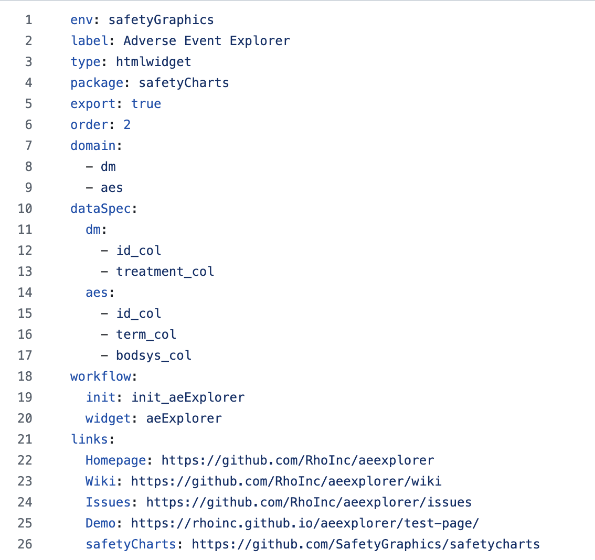
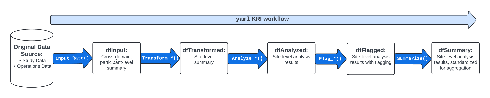

## {.center}

::: {style="font-size: 1.6em; line-height: 1.25;"}
What if your entire data pipeline
were **just a list?**
:::

::: {.notes}
30-min talk + 10-min Q&A. This is the whole thesis — say it out loud, then
spend the next 20 minutes proving it's true at three escalating scales.
Timing: hook ~3, scale ~5, pharmaverse ~8, the twist ~2, close ~2.
:::

## Here's a complete data pipeline

```{.yaml code-line-numbers="|2-4|5-14|"}
# hello_cars.yaml
meta:
  ID: hello_cars
  col: speed
steps:
  - name: dplyr::pull
    output: speed
    params:
      df: df
      col: col
  - name: mean
    output: result
    params:
      lData: speed
```

::: {.notes}
Reveal 1: the whole file. Reveal 2: `meta` = metadata. Reveal 3: `steps` = an
ordered list of function calls, each with an `output` and `params`. That's it.
There is no fourth reveal because there is no more framework to learn.
:::

## That's the whole model {.center}

::: {.tocbox}
- A **workflow** is a YAML list of function calls
- **`lData`** flows through every step, updated as it goes
- **`workr::RunWorkflow()`** runs the list, hands back the last result
:::

::: {.notes}
`RunWorkflows()` (plural) chains lists; each output feeds the next. Keep this
slide fast — it's the contract, not the point.
:::

## Because it's config, not code {.center}


::: {.notes}
`workr::demoApp()`. If live: change `col` from `speed` to `dist` — the answer
updates, the steps never move. The logic is *data* you can edit, diff, and
review, not a script you rewrite. Land this: **declarative beats imperative
when other people have to trust the result.**
:::

# Cute. But does it scale? {.center}

::: {style="opacity:0.75; font-size:0.9em;"}
…let's find out.
:::

## The old way: a script per study {.full-image-slide}

{fig-alt="A large, gnarly study configuration"}

<p class="img-caption">One study. Now imagine thirty, changing every month.</p>

::: {.notes}
~5:00. The tension. Clinical trials are complex: study designs vary, metrics
need study- and even metric-level tweaks. Hand-written per-study scripts
became unmaintainable. Existing tools (`targets`, `glue`) felt too heavy.
:::

## The number that broke the scripts {.center}

::: {style="font-size: 1.15em; line-height: 1.4;"}
30 studies × monthly snapshots
× 15 metrics × 5 steps
:::

::: {style="font-size: 1.8em; margin-top: 0.4em; color:#5fd08a;"}
≈ 27,000 metrics / year
:::

::: {style="font-size: 0.7em; opacity:0.8; margin-top:0.5em;"}
…and every one of them is **regulated, GxP** output.
:::

::: {.notes}
This is the whole reason workr exists. You cannot hand-audit 27k bespoke
scripts a year. You *can* audit one framework and a pile of small YAML lists.
:::

## So we deleted the scripts

- Every metric became the **same list-shape** — only `params` change
- Built `gsm::RunWorkflow()` in **April 2022**, then extracted **`{workr}`**
- Qualified once, via [{qcthat}](https://github.com/Gilead-BioStats/qcthat) —
  now running **20+ studies** in production

{width=62%}

::: {.notes}
Same 5 steps for every KRI; the metric *is* the params. Qualify the framework
once instead of validating thousands of scripts. This is the payoff of "just a
list": auditability at scale.
:::

# …and it's still just a list {.center}

::: {style="opacity:0.75; font-size:0.85em;"}
regulated production. same idea as hello_cars.
:::

# The same shape isn't just ours {.center}

{workr} ❤️ {pharmaverse}

::: {.notes}
~10:00. Second escalation: breadth. The list-shape maps cleanly onto the whole
standard clinical data flow — and none of it is workr-specific.
:::

## One shape, the whole clinical stack {.center}

::: {style="font-size: 1.2em; line-height: 1.5;"}
**RAW** → **SDTM** → **ADaM** → **TFL / ARD**
:::

::: {style="font-size: 0.8em; opacity: 0.85; margin-top: 0.6em;"}
`{sdtm.oak}` · `{admiral}` · `{rmarkdown}` · `{cards}`
:::

::: {.notes}
Each arrow is just more steps. Each package is a set of functions; a function
call is a step. You already know the packages — that's the point.
:::

## A step *is* a function call {.step1-compare}

::: {.columns}
::: {.column width="52%"}
Workflow step
```yaml
steps:
  - output: vs_raw2
    name: sdtm.oak::generate_oak_id_vars
    params:
      raw_dat: vs_raw
      pat_var: "PATNUM"
      raw_src: "vitals"
```
:::
::: {.column width="4%"}
=
:::
::: {.column width="44%"}
Plain R
```R
vs_raw2 <-
  generate_oak_id_vars(
    raw_dat = vs_raw,
    pat_var = "PATNUM",
    raw_src = "vitals"
  )
```
:::
:::

**Adopting a package = knowing the package, not learning {workr}.**

::: {.notes}
The single most important slide of the pharmaverse section. Show ONE mapping in
full so the equivalence is undeniable, then don't belabor it — the audience can
extrapolate the rest.
:::

## …so the rest of the stack is more of the same {.smaller}

| Stage | Package | A representative step |
|---|---|---|
| SDTM → ADaM | `{admiral}` | `admiral::derive_param_map()` → MAP from SYSBP/DIABP |
| ADaM → TFL | `{rmarkdown}` | `rmarkdown::render()` a parameterized template |
| ADaM → ARD | `{cards}` | `cards::ard_summary()` for CDISC Analysis Results Data |

::: {style="font-size:0.7em; opacity:0.85; margin-top:0.4em;"}
`!expr` carries quasiquotation (`exprs()`, `!!`) straight into a step's params.
:::

::: {.notes}
This replaces three near-identical YAML-vs-R slides with one. If the room wants
depth on any row, that's what Q&A and the long-form Phuse Connect deck are for.
:::

## The clinical answer, as two steps {.center}

```yaml
steps:
  - output: predose_map
    name: workr::RunQuery      # SQL over a data.frame
    params:
      df: ADVS
      strQuery: "SELECT * FROM df WHERE PARAMCD='MAP' AND VISIT='VISIT1'"
  - output: table_map
    name: cards::ard_summary   # CDISC ARD
    params:
      data: predose_map
      variables: [AVAL]
```

::: {.notes}
A concrete, satisfying payoff: filter with a workr-native SQL step, summarize
with cards into an ARD. Two lines of list, one regulatory-grade result.
:::

## Where it lands is your call

- Workflows orchestrate **transformation**; **persistence is decoupled**
- Saving to csv / parquet / json / a data lake is *just another step*
- Same list drives a Shiny app, a static site, a PDF over email

::: {.notes}
Don't overclaim on storage — that's deliberately left to the org. The framework
ends at "here is the derived object."
:::

# …and it's still just a list {.center}

# The part we didn't plan for {.center}

::: {style="opacity:0.75; font-size:0.85em;"}
a workflow is data, not code.
:::

## An agent can read *and* write your pipeline

::: {.columns}
::: {.column width="50%"}
**Read**

- Explain a workflow step-by-step
- Diff two runs, spot the change
- Debug a failure in plain English
:::
::: {.column width="50%"}
**Write**

- Generate a new workflow from a request
- Add / reorder steps safely
- {gsm} + {workr} **skills coming soon**
:::
:::

::: {style="text-align:center; margin-top:0.6em; font-size:1.1em; color:#5fd08a;"}
Because it's a list, the pipeline is legible to humans **and** machines.
:::

::: {.notes}
~18:00, the twist. We built workr for auditability; it turned out to be an
ideal substrate for agentic AI, for the exact same reason — the logic is
inspectable data. Modular, inspectable steps are what agents do well.
:::

## What makes it production-real: {workr} 1.1.0

- **Project orchestration** — phase configs, continue-on-error, clearer
  diagnostics
- **Load/save hooks** — incl. GitHub Actions artifact providers to pass data
  between runs
- **Smarter discovery** — active/inactive, priority ordering, exact-name match

::: {style="font-size:0.72em; opacity:0.85; margin-top:0.4em;"}
This is what turns "a list" into a scheduled, restartable, multi-phase run.
:::

::: {.notes}
Tie back to the 27k-metrics story: orchestration + hooks are what make the
scale claim real in a regulated pipeline.
:::

# A data pipeline is just a list. {.center}

::: {style="font-size:0.8em; opacity:0.9; margin-top:0.6em;"}
Simple · scalable · GxP-ready · open source

[gilead-biostats.github.io/workr](https://gilead-biostats.github.io/workr/)
:::

::: {.notes}
Land the mantra one last time and hand to Q&A. Deep-dive material — full data
model, the gsm report gallery, the enterprise gismo platform, open.gismo —
lives in the long-form Phuse Connect deck if questions go there.
:::
